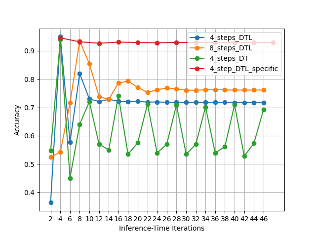

# mac
=======
# Pytorch implementation of the MAC-Network + Lipschitz Normalised Deep Thinking

Pytorch implementation of the 2018 ICLR Paper [Compositional Attention Networks for Machine Reasoning](https://arxiv.org/abs/1803.03067) (MAC Network), based on [original implementation](https://github.com/stanfordnlp/mac-network), [rosinality](https://github.com/rosinality/mac-network-pytorch) and [tohinz](https://github.com/tohinz/pytorch-mac-network).
It combines MAC with Lipschitz normalised Deep Thinking architecture [Deep Thinking](http://arxiv.org/abs/2410.23451) that allows model to adjust the number of reasoning steps during inference time. The original MAC-Network is limited to a fixed number of reasoning steps, which is set during training and cannot be changed during inference. 
The proposed hybrid architecture is hypothesised to improve the extrapolation performance of the model.
All codes have been updated to match modern Pytorch standards and are compatible with the latest version of Pytorch (2.8.0).


**Prepare dataset**:
- Download and extract [CLEVR v1.0 dataset](http://cs.stanford.edu/people/jcjohns/clevr/)
- Preprocess question data:  `python preprocess.py [CLEVR directory]`
- Extract image features with ResNet 101 as described in the original [Git](https://github.com/stanfordnlp/mac-network#feature-extraction)
- Put extracted features and preprocessed question data into the `data` folder so you have the following files:
    - `data/train_features.h5`
    - `data/val_features.h5`
    - `data/train.pkl`
    - `data/val.pkl`
    - `data/dic.pkl`

**To train**:
```
python code/main.py --cfg cfg/clevr_train_mac.yml --gpu 0
```
- The number of reasoning steps can be changed through the config file (`TRAIN -> MAX_STEPS`) - default value is `4`.
- The basic implementation closely mirrors the parameters and config settings from the original implementation's args.txt, i.e. this line in the original [Git](https://github.com/stanfordnlp/mac-network#model-variants): `python main.py --expName "clevrExperiment" --train --testedNum 10000 --epochs 25 --netLength 4 @configs/args.txt` (we evaluate on the full validation set though)

**To inference**:
```
python code/inference.py --cfg cfg/clevr_test_mac.yml --gpu 0 --model_path [path to model] --image_file [path to image file] --question [question string]
```

**To validate on the validation set**:
```
python code/validate.py --cfg cfg/clevr_test_mac.yml --gpu 0 --model_path [path to model] --steps [number of reasoning steps]
```
**Results**:
The main target of this project is to experiment the hybrid architecture of MAC-Network and Deep Thinking. Primarily focusing on testing extrapolation, stability and training convergence. The overall performance are not yet comparable to the original paper,
but it can adjust the number of reasoning steps during inference time which is impossible in the original MAC network. Therefore, the Deep Thinking architecture could potentially improve model's reasoning performance.

Another key achievement is the **MAC_DTL_specific** model, which retains step specific layers in the control unit - unlike other conventional Deep Learning architectures.
Among all DTL models, it demonstrates the best performance and stability during inference. This model effectively combines the advantages of both MAC and DTL architectures, allowing for a more flexible and adaptive reasoning process.

Performance of the model on the validation set with different number of reasoning steps:

